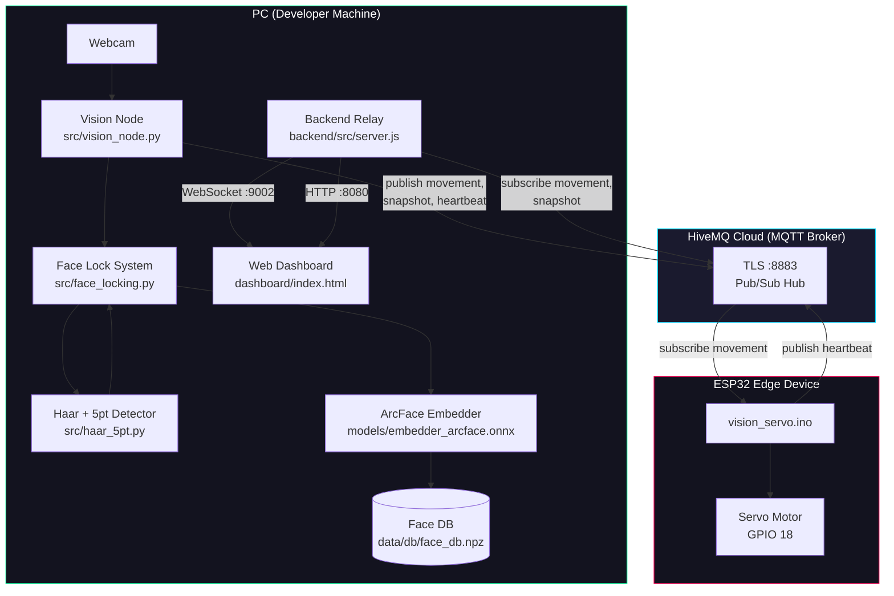
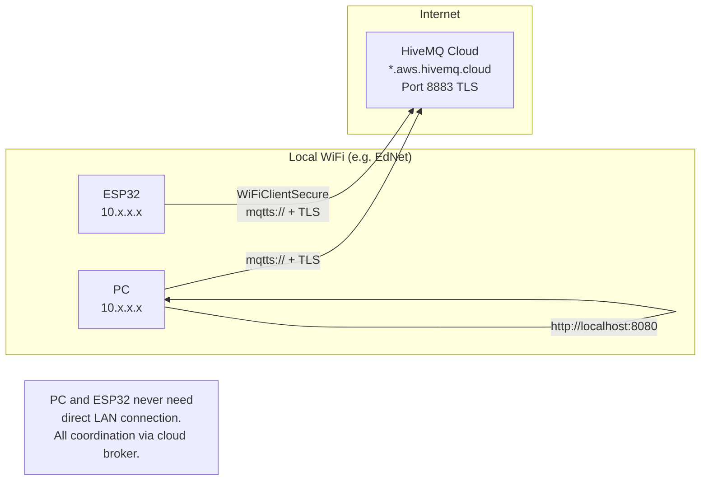
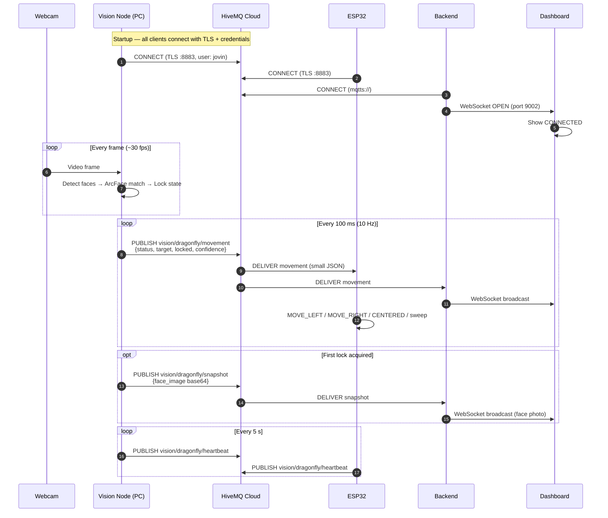
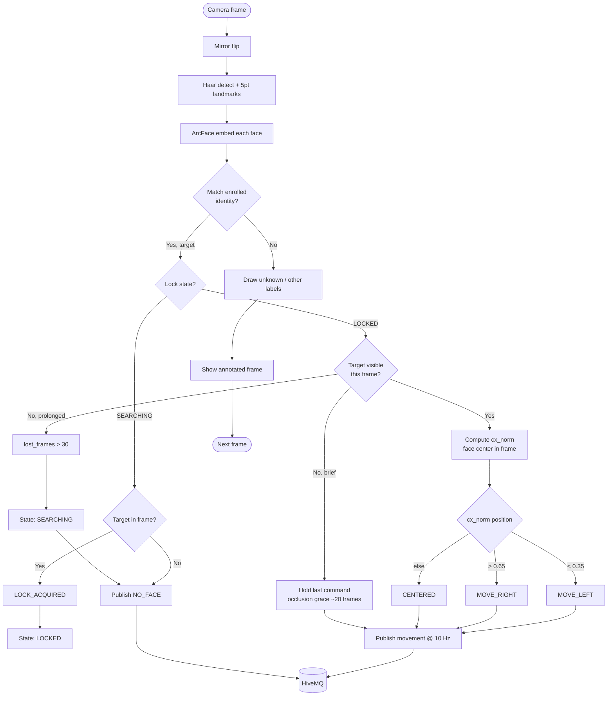
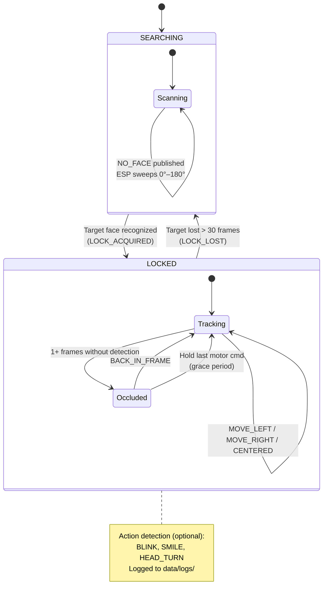
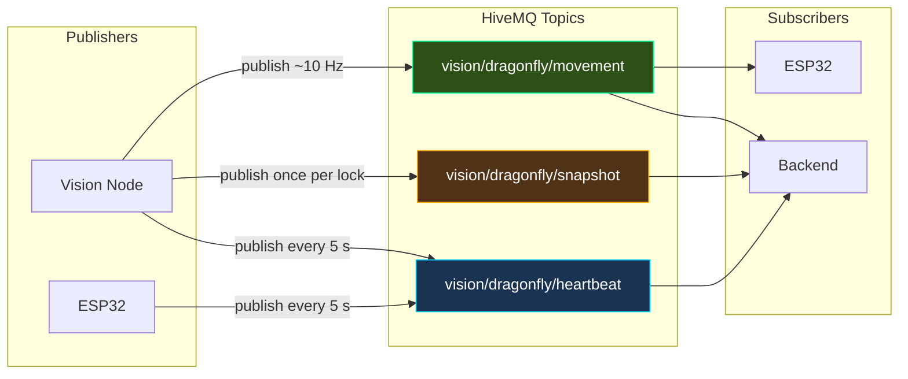
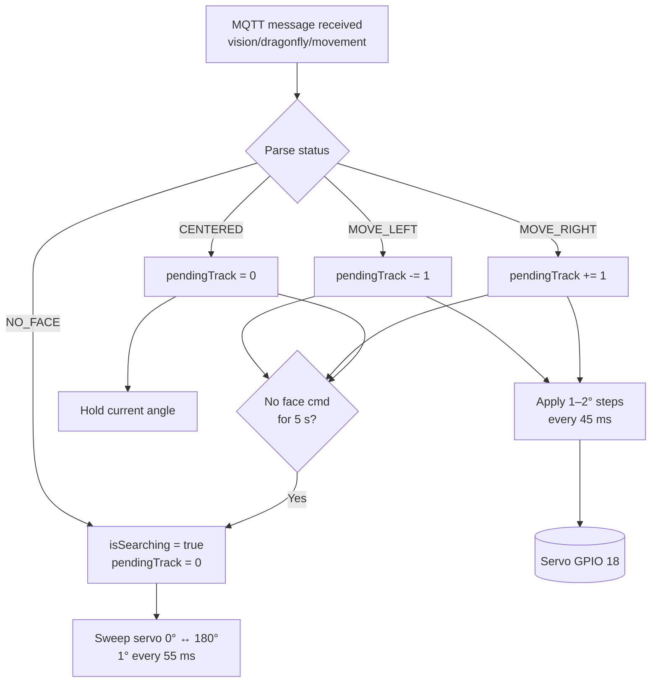
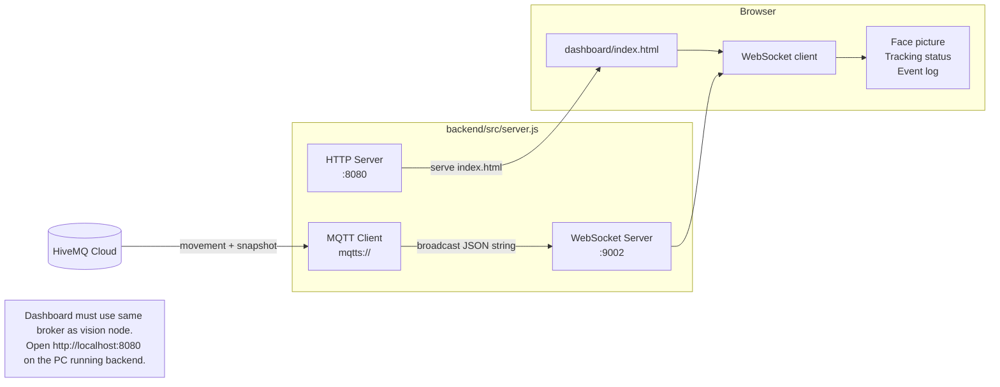
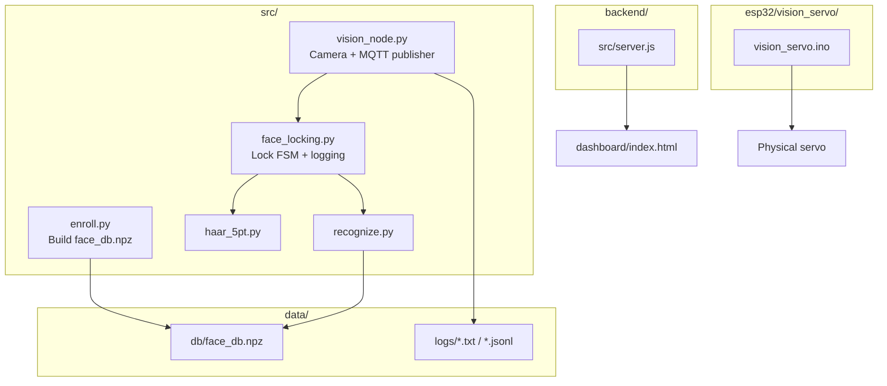
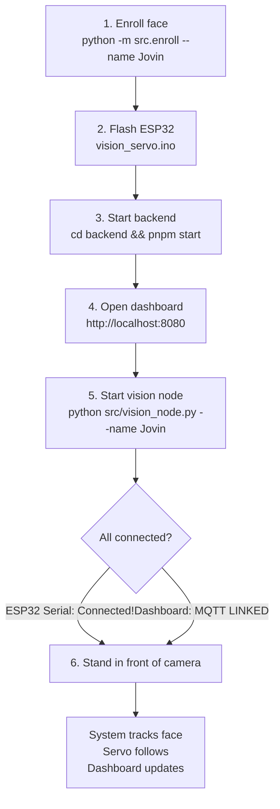

# Face-Locking System — Mermaid Diagrams

Architecture and data-flow diagrams for the distributed face recognition + servo tracking system.

**Broker:** HiveMQ Cloud (`olivequeen-db8548cb.a03.euc1.aws.hivemq.cloud:8883`, TLS)  
**Team ID:** `dragonfly`  
**MQTT prefix:** `vision/dragonfly/`

---

## 1. System Architecture (High Level)



---

## 2. Network & Deployment Topology



---

## 3. End-to-End Message Flow (Sequence)



---

## 4. Vision Node Processing Pipeline



---

## 5. Face Locking State Machine



---

## 6. MQTT Topics & Publishers



### Movement payload (small — ESP32 safe)

```json
{
  "status": "MOVE_LEFT | MOVE_RIGHT | CENTERED | NO_FACE",
  "confidence": 0.85,
  "target": "Jovin",
  "locked": true,
  "timestamp": 1781270502.65
}
```

### Snapshot payload (large — dashboard only)

```json
{
  "target": "Jovin",
  "confidence": 0.85,
  "timestamp": 1781270502.65,
  "face_image": "<base64 JPEG>"
}
```

---

## 7. ESP32 Servo Control Logic



---

## 8. Dashboard Relay Path



---

## 9. Component File Map



---

## 10. Typical Run Order



---

## Viewing these diagrams

- **GitHub / GitLab** — renders Mermaid in `.md` files automatically.
- **VS Code / Cursor** — install a Mermaid preview extension, or use Markdown preview.
- **Online** — paste any block into [https://mermaid.live](https://mermaid.live).
